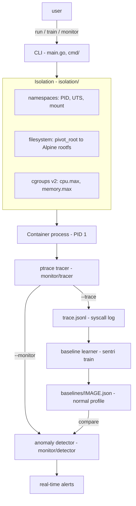

# sentri

**A minimal container runtime built from scratch in Go — Linux namespaces,
cgroups v2, and filesystem isolation — with an integrated syscall-level anomaly
detector that learns each image's "normal" behaviour and flags deviations in
real time.**

Most "build your own Docker" projects stop at isolation. `sentri` adds a security
layer *inside* the runtime: it traces every syscall a container makes, learns a
baseline profile per image, and raises live alerts when a running container steps
outside that profile — a purpose-built, lightweight intrusion-detection system in
the spirit of [Falco](https://falco.org/), rather than isolation with security
bolted on afterwards.

> ⚠️ **Linux + root required.** `sentri` uses `clone()` namespace flags, cgroups
> v2, `pivot_root`, and `ptrace` — Linux-only kernel features. It does **not** run
> on macOS or Windows. Run it on a real Linux machine, VM, or cloud instance, as
> **root / with `sudo`** (namespace and cgroup operations need `CAP_SYS_ADMIN`).
> Syscall decoding is **x86-64 (amd64)**-specific.

---

## Demo — catching a simulated compromise

▶️ **Watch the 30-second demo:** <!-- REPLACE: paste your screen-recording link here -->
_(recording link — see "Adding the demo recording" below)_

The scenario: train a baseline from a benign "app", then run two workloads under
live monitoring — the **same benign app** (no alerts), and a **compromised
payload** that phones home and tampers with a file. Same runtime, opposite
verdicts:

```text
$ sudo ./sentri run --monitor webapp /bin/sh /normal.sh
[sentri] monitoring against baseline "webapp" (26 known syscalls)
app: healthy
✓ no anomalies — behaviour matched baseline "webapp"

$ sudo ./sentri run --monitor webapp /bin/sh /payload.sh
[sentri] monitoring against baseline "webapp" (26 known syscalls)
🚨 ANOMALY  syscall=socket   pid=8821  container=1a2b3c4d  reason=never-seen-in-baseline(webapp)
🚨 ANOMALY  syscall=connect  pid=8821  container=1a2b3c4d  reason=never-seen-in-baseline(webapp)
🚨 ANOMALY  syscall=chmod    pid=8823  container=1a2b3c4d  reason=never-seen-in-baseline(webapp)  path="/tmp/work"
payload: done
✗ 3 anomalous syscall(s) across 3 type(s): [chmod connect socket]
```

*(The alert lines render bold-red in a real terminal. Excerpt above is
representative — swap in your captured output if you prefer verbatim.)*

---

## What this demonstrates

- **OS/kernel fundamentals:** namespaces, cgroups v2, `pivot_root`, `ptrace` —
  used directly via syscalls, no container libraries.
- **A security-engineering angle:** behavioural baselining and anomaly detection,
  built into the runtime rather than added alongside it.
- **Honest engineering:** the code is heavily commented to be *explained and
  defended* — including its limitations (see the end of this README).

It is a **demonstration of understanding, not a hardened production sandbox.**

---

## Architecture



| Component | Package / file | Responsibility |
|-----------|----------------|----------------|
| CLI | `main.go`, `cmd/` | Parse `run` / `train`; dispatch the internal `child` re-exec |
| Namespaces | `isolation/namespaces.go` | Clone the container into new PID/UTS/mount namespaces |
| Filesystem | `isolation/filesystem.go` | `pivot_root` onto the Alpine rootfs; mount `/proc` |
| Cgroups | `isolation/cgroups.go` | Create/limit/clean up a cgroup v2 cgroup |
| Tracer | `monitor/tracer_linux_amd64.go` | `ptrace` loop → a stream of `SyscallEvent`s |
| Learner | `monitor/baseline.go` | Aggregate a trace into a per-image profile (JSON) |
| Detector | `monitor/detector.go` | Compare live syscalls to the baseline; alert |

---

## How the anomaly detection works (plain language)

Security detection comes in two flavours. **Signature-based** detection looks for
known-bad patterns (a specific malware hash, a known exploit string) — precise,
but blind to anything new. **Anomaly-based** (behavioural) detection instead
learns what *normal* looks like and flags anything that deviates — it can catch
novel attacks, at the cost of needing a good "normal" model.

`sentri` is anomaly-based, applied at the **syscall** level:

1. **Learn.** `sentri train <image>` runs a known-good workload, traces every
   syscall, and records which syscalls that image makes and how often — its
   "normal" profile (`baselines/<image>.json`).
2. **Detect.** `sentri run --monitor <image>` traces a live container and, for
   every syscall as it happens, asks: *was this ever part of normal for this
   image?* If not, it alerts immediately.

The insight is that a compromise almost always has to do something *new at the
syscall level* — a benign file-processing app that suddenly opens a network
socket (`socket`/`connect`), rewrites file permissions (`chmod`), or attaches a
debugger (`ptrace`) is making syscalls its normal profile never contained.

**Link to SIEM/IPS work.** This is the same principle behind anomaly-based IDS/IPS
and UEBA in a SOC: establish a behavioural baseline, then alert on deviation. Here
the "log source" is the kernel's syscall stream and the "baseline" is per-image
instead of per-user/host.
<!-- Personalise: cite your SIEM/IPS home-lab and/or dissertation n-gram work here. -->

---

## Quick start

**1. Build** (on the Linux box):
```bash
go build -o sentri .
```

**2. Get a root filesystem into `./rootfs`** — `sentri` doesn't implement an image
registry (out of scope); you populate `./rootfs` once with a minimal Alpine
rootfs, and every run pivots into it:
```bash
# downloads the current stable Alpine minirootfs and extracts it into ./rootfs
BASE=https://dl-cdn.alpinelinux.org/alpine/latest-stable/releases/x86_64
FILE=$(curl -s "$BASE/" | grep -o 'alpine-minirootfs-[0-9.]*-x86_64.tar.gz' | sort -u | head -1)
curl -LO "$BASE/$FILE"
sudo tar -xzf "$FILE" -C rootfs        # sudo preserves root file ownership
cat rootfs/etc/os-release              # sanity check → "Alpine Linux"
```
*(`rootfs/` is git-ignored — large and easy to re-fetch, so it's never committed.)*

**3. Run an isolated shell:**
```bash
sudo ./sentri run /bin/sh
# inside: PID 1, own hostname, Alpine filesystem, own process tree
```

**4. Try the security layer** (the demo):
```bash
sudo cp demo/normal_workload.sh rootfs/normal.sh
sudo cp demo/compromised_payload/payload.sh rootfs/payload.sh
sudo ./sentri train webapp /bin/sh /normal.sh          # learn "normal"
sudo ./sentri run --monitor webapp /bin/sh /normal.sh  # → no anomalies
sudo ./sentri run --monitor webapp /bin/sh /payload.sh # → real-time alerts
```

---

## Commands

```text
sentri run   [--memory <size>] [--cpus <n>] [--trace] [--monitor <image>] [command...]
sentri train <image> [command...]
```

| Flag | Effect |
|------|--------|
| `--memory 100m` | Cap container memory (cgroup `memory.max`); OOM-kills past it |
| `--cpus 0.5` | Cap CPU to half a core (cgroup `cpu.max`) |
| `--trace` | Log every syscall to `trace.jsonl` (JSON lines) |
| `--monitor <image>` | Live anomaly detection against `<image>`'s baseline |

Flags go **before** the command. Default command is `/bin/sh`.

---

## Implementation notes

### Namespaces — isolating *visibility*
`sentri run` clones the container into three namespaces: **PID** (`CLONE_NEWPID`
— the shell is PID 1 and can't see host processes), **UTS** (`CLONE_NEWUTS` — own
hostname), and **mount** (`CLONE_NEWNS` — own mount table). Because Go's runtime
is multi-threaded and can't safely enter namespaces in-process, `sentri`
re-executes its own binary (`/proc/self/exe`) as a hidden `child` that the kernel
places into the new namespaces — the same "re-exec" pattern Docker's libcontainer
uses.

### `pivot_root`, not `chroot` — isolating the filesystem
`chroot(2)` only changes path resolution and leaves the process attached to the
host, so a root process can escape it (hold a dir fd outside the new root,
`chdir("..")` above it, `chroot(".")` back onto the host). `pivot_root(2)` +
the mount namespace instead swaps the root **mount** and lets `sentri` **unmount
the old host root** (`MNT_DETACH`) — the host filesystem isn't hidden, it's gone
from the namespace. See [`isolation/filesystem.go`](isolation/filesystem.go).

### Cgroups v2 — limiting *consumption*
Namespaces isolate what a process can *see*; cgroups limit what it can *use*.
`sentri` creates `/sys/fs/cgroup/sentri/<id>/`, delegates the `cpu`+`memory`
controllers, writes `memory.max`/`cpu.max`, and places the container into the
cgroup **atomically at clone time** (`CLONE_INTO_CGROUP`) so it's constrained
from its first instruction. The cgroup is removed on exit (with a `cgroup.kill` +
retry to beat the kernel's async-release `EBUSY` race). See
[`isolation/cgroups.go`](isolation/cgroups.go).

### `ptrace`, not `seccomp` — tracing syscalls
`ptrace(PTRACE_SYSCALL)` sees **every** syscall with its arguments and can read
tracee memory (so paths like `openat("/etc/os-release")` are decoded) — exactly
what a *learn-and-detect* system needs. seccomp-BPF is lower-overhead and can
*block*, but its filter can't dereference pointers. The production design is the
hybrid (seccomp `RET_TRACE` fast-pathing into ptrace). Cost: ~2× wall-time on a
syscall-heavy workload (two context switches per syscall). The tracer is a single
locked-OS-thread loop that follows `fork`/`vfork`/`clone` children and detects
syscall-entry via the kernel's `-ENOSYS` sentinel. See
[`monitor/tracer_linux_amd64.go`](monitor/tracer_linux_amd64.go).

### Baseline — a per-syscall frequency profile
The baseline is a map of syscall name → count (plus totals), keyed by image.
It's order-independent, tiny, accumulates across training runs, and directly
answers the detector's question ("seen before?"). A sequence/**bigram** model
(ordered pairs — catches anomalous *ordering*) is a documented future extension,
kept out of the MVP on purpose. See [`monitor/baseline.go`](monitor/baseline.go).

### Anomaly rule — stated exactly
A syscall is flagged **iff its name was never observed in the baseline for that
image** ("unknown-syscall" rule). No threshold, no magic number: a workload
matching training yields zero alerts; a compromise doing something new is caught.
Alerts are de-duplicated to one line per distinct syscall for readability. A
frequency/rate rule is available in principle but left off to avoid false
positives. See [`monitor/detector.go`](monitor/detector.go).

---

## Testing

Kernel-dependent parts (namespaces, cgroups, ptrace) are verified by running real
containers and asserting on observable outcomes (PID 1 inside, hostname
isolation, enforced limits, alerts firing). The **pure logic** — baseline
aggregation and anomaly scoring — has proper unit tests fed synthetic syscall
logs, runnable on any platform:

```bash
go test ./monitor
```

---

## Limitations and what this is *not*

Being explicit here is deliberate — overclaiming security guarantees would be the
real red flag.

- **Not a production sandbox.** The container runs as **real root with full
  capabilities** and the entire syscall surface. Real hardening needs a **user
  namespace** (so container-root ≠ host-root), **capability dropping**, and a
  **seccomp** allowlist — none of which `sentri` implements.
- **Detection, not prevention.** `sentri` *flags* anomalous syscalls; it does not
  *block* them. Blocking is seccomp enforcement — a natural next step, not built.
- **`ptrace` has real costs.** ~2× overhead on syscall-heavy workloads, and
  ptrace-based tracing has known bypasses; it's an observation tool here, not a
  security boundary.
- **Baseline trade-offs are inherent.** The profile is only as good as the
  training workload: too narrow → benign-but-unseen behaviour looks anomalous
  (false positives); too broad → real compromises blend in (false negatives). The
  unknown-syscall rule also can't catch a compromise that only *reorders* or
  *over-uses* already-normal syscalls — that's what the bigram/rate extensions
  would address.
- **No networking or OCI images.** No bridge/veth/NAT; no registry client (you
  supply the rootfs). Both are noted non-goals.
- **linux/amd64 only.** Syscall numbers and register layout are architecture-
  specific.

---

## Project status

Built milestone by milestone against [`docs/spec.md`](docs/spec.md):

- [x] **M1** — Process isolation via namespaces (PID, UTS, mount)
- [x] **M2** — Filesystem isolation (`pivot_root` onto Alpine rootfs)
- [x] **M3** — Resource limiting via cgroups v2 (CPU + memory)
- [x] **M4** — Syscall tracing (`ptrace`, JSON-lines log)
- [x] **M5** — Baseline learner (`sentri train`)
- [x] **M6** — Real-time anomaly detection (`sentri run --monitor`) + demo
- [x] **M7** — Documentation and polish

**Possible next steps:** seccomp enforcement (block, not just detect); a
bigram/sequence baseline; a user namespace + capability drop; a network
namespace; a webhook alert sink.
